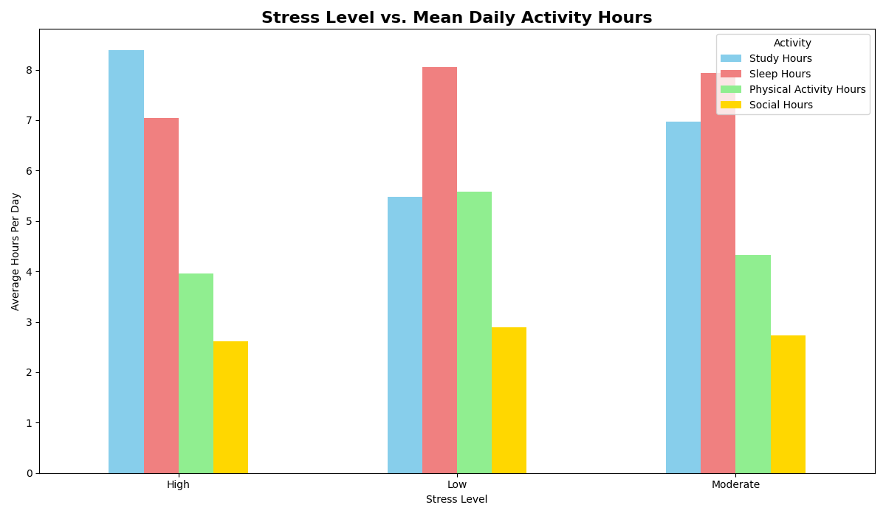

# Student-Study-Habits-Analysis
Data analysis project exploring how students’ daily habits affect GPA and stress using Pandas, Matplotlib, and Seabor
# 🎓 Student Study Habits Analysis

This project analyzes the relationship between **students' daily habits** (study hours, sleep, physical activity, and social life) and their **academic performance and stress levels** using real-world data from [Kaggle](https://www.kaggle.com/datasets/afnansaifafnan/study-habits-and-activities-of-students).

## 📊 Project Overview

This analysis explores how lifestyle choices affect **GPA** and **stress levels** among students.  
It demonstrates skills in **data cleaning**, **statistical analysis**, and **visualization** using **Pandas**, **Matplotlib**, and **Seaborn**.

## 🧠 Objectives

- Clean and preprocess raw CSV data for analysis  
- Visualize correlations between study habits and stress  
- Examine the impact of study hours on GPA  
- Highlight patterns in daily time allocation (sleep, study, social, and physical activity)

## 🧰 Tools & Libraries

- **Python 3.x**
- **Pandas** – Data cleaning & manipulation  
- **NumPy** – Numerical computations  
- **Matplotlib** – Static visualizations  
- **Seaborn** – Statistical data visualization  

## 🗂️ Dataset

- Source: [Kaggle – Study Habits and Activities of Students](https://www.kaggle.com/datasets/afnansaifafnan/study-habits-and-activities-of-students)
- Contains details about students’ study hours, GPA, sleep time, and stress level.

---

## 📈 Key Visualizations

### 1️⃣ Stress Level vs. Daily Activity Hours  
 
> Shows how stress correlates with time spent on different daily activities.

---

### 2️⃣ Overall Daily Time Allocation  
  
> Displays how students distribute their time among key activities.

---

### 3️⃣ Impact of Study Hours on GPA and Stress  
  
> Dual-axis chart showing how GPA and stress vary with study hours.

---

## 🧹 Data Cleaning Steps

- Replaced missing or invalid entries  
- Mapped categorical stress levels to numeric scale (Low=1, Moderate=2, High=3)  
- Aggregated data by study hours and activity type  
- Exported cleaned dataset to `Cleaned_study_habits&Activities.csv`

## 💡 Insights

- **More study hours** generally improve GPA, but **increase stress** levels beyond 6–8 hours/day.  
- Balanced routines (adequate sleep + physical activity) correlate with **lower stress**.  
- Students who maintain consistent sleep patterns perform better academically.

## 🧾 Files

| File | Description |
|------|--------------|
| `notebook.ipynb` | Main analysis notebook |
| `charts/` | Folder containing all generated visualizations |
| `Cleaned_study_habits&Activities.csv` | Processed dataset |
| `README.md` | Project overview and documentation |

---

## 📬 Author

**Muhammad Ijlal**  
Data Science & AI Learner | Python + Visualization Enthusiast  
📧 [Muhammad.ijlal061@gmail.com]

